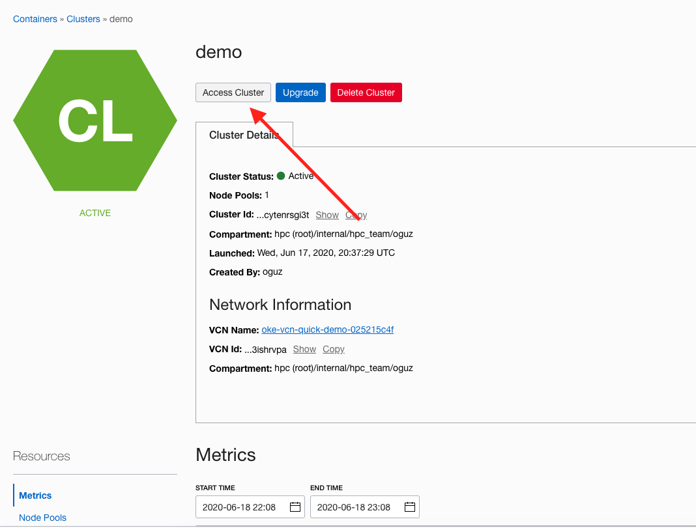

### Deploying and accessing an OKE cluster

1. Create a new Kubernetes cluster using the Quick Create option in OCI.
https://docs.cloud.oracle.com/en-us/iaas/Content/ContEng/Tasks/contengcreatingclusterusingoke.htm#create-quick-cluster

2. Access the cluster in **Cloud Shell**. You can access it from your local machine too, but Cloud Shell is the easiest/fastest way.



3. In the Cloud Shell, run the following command to see the nodes in your cluster.

```sh
kubectl get nodes
```

You will see an output like below:
```
$ kubectl get nodes
NAME        STATUS   ROLES   AGE   VERSION
10.0.10.5   Ready    node    26h   v1.14.8
10.0.10.6   Ready    node    26h   v1.14.8
10.0.10.7   Ready    node    26h   v1.14.8
```

### Deploying a basic application to Kubernetes

Here's what we will do:

- Run five instances of a Hello World application.
- Create a Service object that exposes an external IP address.
- Use the Service object to access the running application.

1. Let's create a service for an application running in five pods.

Here's the yaml that has everything for the configuration.

You can see that we can set the number of replicas (number of pods to be deployed) with the `replicas` field in the yaml below.

```yaml
apiVersion: apps/v1
kind: Deployment
metadata:
  labels:
    app.kubernetes.io/name: load-balancer-example
  name: hello-world
spec:
  replicas: 5
  selector:
    matchLabels:
      app.kubernetes.io/name: load-balancer-example
  template:
    metadata:
      labels:
        app.kubernetes.io/name: load-balancer-example
    spec:
      containers:
      - image: gcr.io/google-samples/node-hello:1.0
        name: hello-world
        ports:
        - containerPort: 8080
```

2. We will apply the yaml above with the following command:

```sh
kubectl apply -f https://k8s.io/examples/service/load-balancer-example.yaml
```

3. Run the following command to get the status of the deployment:

```sh
kubectl get deployment
```

You should see something similar to this:

```sh
$ kubectl get deployment                
NAME          READY   UP-TO-DATE   AVAILABLE   AGE
hello-world   5/5     5            5           55s
```

This tells us that we have asked for 5 replicas and all of them are up and running.

4. To see the individual pods that the deployment has, you can type the following command:

```sh
kubectl get pods
```

You should see something similar to this:

```sh
$ kubectl get pods
NAME                           READY   STATUS    RESTARTS   AGE
hello-world-7dc74ff97c-89h59   1/1     Running   0          3m36s
hello-world-7dc74ff97c-9zr4j   1/1     Running   0          3m36s
hello-world-7dc74ff97c-c2zq5   1/1     Running   0          3m36s
hello-world-7dc74ff97c-n4tf8   1/1     Running   0          3m36s
hello-world-7dc74ff97c-x4dgt   1/1     Running   0          3m36s
```

That tells us our application is running in each of these 5 pods.

5. This deployment is not accesible publicly. We need to `expose` it to make it accessible with the following command:

```sh
kubectl expose deployment hello-world --type=LoadBalancer --name=my-service
```

Notice that the type is `LoadBalancer`. Because we have an OKE cluster, it knows how to talk to the OCI API to create a load balancer. So Kubernetes will create a load balancer in OCI for us and attach its public IP to our hello-world service.


6. Let see the details of our service. Run:

```sh
kubectl get service
```

The output should be similar to this:

```sh
$ kubectl get service
NAME           TYPE           CLUSTER-IP      EXTERNAL-IP   PORT(S)          AGE
my-service     LoadBalancer   10.96.164.137   <pending>     8080:31178/TCP   8s
```

The `EXTERNAL-IP` will be pending for about 30 seconds. Kubernetes is talking to OCI to get an IP. We will see a public IP after it gets it. Run the same command again after about 30 seconds and you will see the public IP.

```sh
kubectl get svc                
NAME         TYPE           CLUSTER-IP      EXTERNAL-IP       PORT(S)          AGE
my-service   LoadBalancer   10.96.164.137   150.136.190.208   8080:31178/TCP   5m15s
```

7. Now you have successfully deployed an application and exposed it publicly in Kubernetes!

Open a browser tab and go to the IP that is shown under `EXTERNAL-IP` and port 8080.

For example:

http://150.136.190.208:8080

You should see a page that says `Hello Kubernetes!`.

9. Scaling out this application is also easy with Kubernetes. We deployed 5 pods initially. Let's say there's an increase in traffic and we want to scale our application. So, we want to increase the number of pods to 7 from 5. We can do that easily by running the following command:

```sh
kubectl scale deployment hello-world --replicas 7
```

Now we have 7 pods in our deployment:

```sh
$ kubectl get pods
NAME                           READY   STATUS    RESTARTS   AGE
hello-world-7dc74ff97c-89h59   1/1     Running   0          21m
hello-world-7dc74ff97c-9zr4j   1/1     Running   0          21m
hello-world-7dc74ff97c-c2zq5   1/1     Running   0          21m
hello-world-7dc74ff97c-d28fj   1/1     Running   0          107s
hello-world-7dc74ff97c-n4tf8   1/1     Running   0          21m
hello-world-7dc74ff97c-njr2m   1/1     Running   0          106s
hello-world-7dc74ff97c-x4dgt   1/1     Running   0          21m
```


10. Finally, let's delete what we deployed.

To delete the service:

```sh
kubectl delete services my-service
```

To delete the deployment:

```sh
kubectl delete deployment hello-world
```
