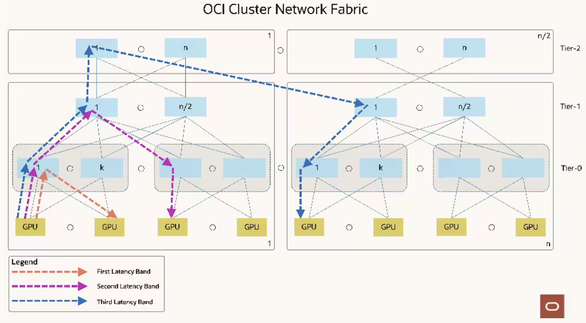

# Using network locality when running workloads on OKE

> [!IMPORTANT]  
> To use the instructions in this guide, you must have a dedicated capacity pool and you must create a capacity topology. Otherwise, `rdmaTopologyData` in instance metadata service and related node labels in OKE will not be available.

## What is network locality?
Generative AI workloads drive a different set of engineering tradeoffs than traditional cloud workloads. So, we designed a purpose-built GenAI network tailored to the needs of the best-of-breed Generative AI workloads.

When possible, running a job using the nodes in the same Local Block will provide the best performance. Because the number of nodes in a Local Block is limited; depending on the number of nodes you have, the number of your concurrent jobs running, and the size of your jobs, you might need to use the nodes from another Local Block in the same Network Block or from another Network Block.

Local Block is the first latency band (Tier-0), Network Block is the second latency band (Tier-1), and HPC Island is the third latency band (Tier-2) in OCI's RDMA networks. You can read [this blog post](https://blogs.oracle.com/cloud-infrastructure/post/first-principles-zettascale-oci-superclusters) and watch the [YouTube video](https://www.youtube.com/watch?v=cZy22n5Ih78) for learning more about OCI's RDMA network design.



## What type of network tier information will I have?
When you have a dedicated capacity pool and a capacity topology created for the availability domain, the following information will be available in the instance metadata service for bare metal GPU shapes:

```
curl -H 'Authorization: Bearer Oracle' http://169.254.169.254/opc/v2/host/rdmaTopologyData

{
  "customerHPCIslandId": "ocid1.hpcisland.oc1.iad.anuwcljrg5pyaeycajoqlss...",
  "customerHostId": "ocid1.computebaremetalhost.oc1.iad.anuwcljrg5pyaeycu...",
  "customerLocalBlock": "ocid1.computelocalblock.oc1.iad.anuwcljrg5pyaeyc...",
  "customerNetworkBlock": "ocid1.computenetworkblock.oc1.iad.anuwclddsdef..."
```

## How do I use network locality information when running workloads on OKE?
When the locality information is available in the instance metadata service, OKE will add the following labels to your nodes during bootstrapping:

```
oci.oraclecloud.com/rdma.host_id
oci.oraclecloud.com/rdma.hpc_island_id
oci.oraclecloud.com/rdma.local_block_id
oci.oraclecloud.com/rdma.network_block_id
```
The values of the labels are hashes of the information available in instance metadata and they will be different than the OCIDs above.

Example:
```
oci.oraclecloud.com/rdma.host_id=ab3zs7y7v7q
oci.oraclecloud.com/rdma.hpc_island_id=af7ubvouuyq
oci.oraclecloud.com/rdma.local_block_id=4tjxbt4s6ua
oci.oraclecloud.com/rdma.network_block_id=7xmzl4p4wba
```

You can use these labels to create affinity rules for your workloads. Visit [this link](https://kubernetes.io/docs/concepts/scheduling-eviction/assign-pod-node/) if you want to learn more about using affinity rules on Kubernetes.

Note that because we're using soft rules (`preferredDuringSchedulingIgnoredDuringExecution`), the scheduler will try to find a node that meets the rules. If a matching node is not available, the scheduler will still schedule the pod.

You can use hard rules instead (`requiredDuringSchedulingIgnoredDuringExecution`), but that means the scheduler can't schedule the pod unless the rules are met. So your jobs might not start depending on node availability.

### Using node affinity
When using node affinity, you will need to provide the values of the `oci.oraclecloud.com/rdma.local_block_id`, `oci.oraclecloud.com/rdma.network_block_id`, and `oci.oraclecloud.com/rdma.hpc_island_id` labels. Instead of hardcoding them, you can use tools like `sed` or `yq` to change them when you're scheduling jobs. Or if you're using Helm, you can templatize those values.

```yaml
apiVersion: apps/v1
kind: Deployment
metadata:
  name: node-affinity-example
spec:
  replicas: 3
  selector:
    matchLabels:
      app: node-affinity-app
  template:
    metadata:
      labels:
        app: node-affinity-app
    spec:
      affinity:
        nodeAffinity:
          preferredDuringSchedulingIgnoredDuringExecution:
            - weight: 100
              preference:
                matchExpressions:
                  - key: oci.oraclecloud.com/rdma.local_block_id
                    operator: In
                    values:
                      - 5tjxbt5s6ua
            - weight: 50
              preference:
                matchExpressions:
                  - key: oci.oraclecloud.com/rdma.network_block_id
                    operator: In
                    values:
                      - 7xmzl5p5wba
            - weight: 25
              preference:
                matchExpressions:
                  - key: oci.oraclecloud.com/rdma.hpc_island_id
                    operator: In
                    values:
                      - af7ubvouuyq      
      containers:
        - name: nginx
          image: nginx
          ports:
            - containerPort: 80
          resources:
            requests:
              cpu: "100m"
              memory: "128Mi"
            limits:
              cpu: "500m"
              memory: "256Mi"
```

### Using pod affinity
When using pod affinity, because you're relying on the `topologyKey` instead of node labels, you don't need to provide the values for the `oci.oraclecloud.com/rdma.local_block_id`, `oci.oraclecloud.com/rdma.network_block_id`, and `oci.oraclecloud.com/rdma.hpc_island_id` labels.

```yaml
apiVersion: apps/v1
kind: Deployment
metadata:
  name: pod-affinity-example
spec:
  replicas: 3
  selector:
    matchLabels:
      app: pod-affinity-app
  template:
    metadata:
      labels:
        app: pod-affinity-app
    spec:
      affinity:
        podAffinity:
          preferredDuringSchedulingIgnoredDuringExecution:
            - weight: 100
              podAffinityTerm:
                labelSelector:
                  matchExpressions:
                    - key: app
                      operator: In
                      values:
                        - pod-affinity-app
                topologyKey: oci.oraclecloud.com/rdma.local_block_id
            - weight: 50
              podAffinityTerm:
                labelSelector:
                  matchExpressions:
                    - key: app
                      operator: In
                      values:
                        - pod-affinity-app
                topologyKey: oci.oraclecloud.com/rdma.network_block_id
            - weight: 25
              podAffinityTerm:
                labelSelector:
                  matchExpressions:
                    - key: app
                      operator: In
                      values:
                        - pod-affinity-app
                topologyKey: oci.oraclecloud.com/rdma.hpc_island_id                
      containers:
        - name: nginx
          image: nginx
          ports:
            - containerPort: 80
          resources:
            requests:
              cpu: "100m"
              memory: "128Mi"
            limits:
              cpu: "500m"
              memory: "256Mi"

```

