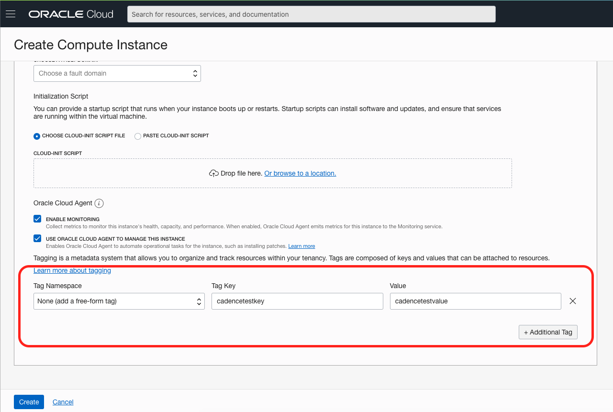
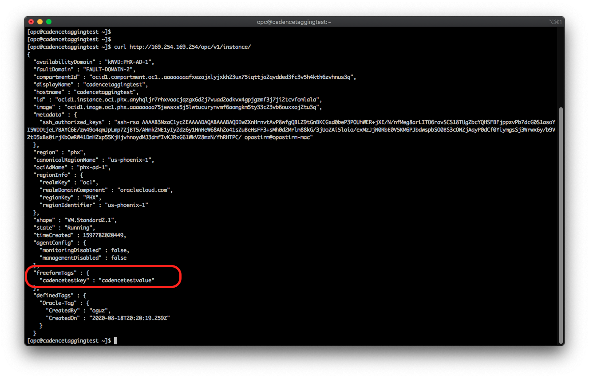
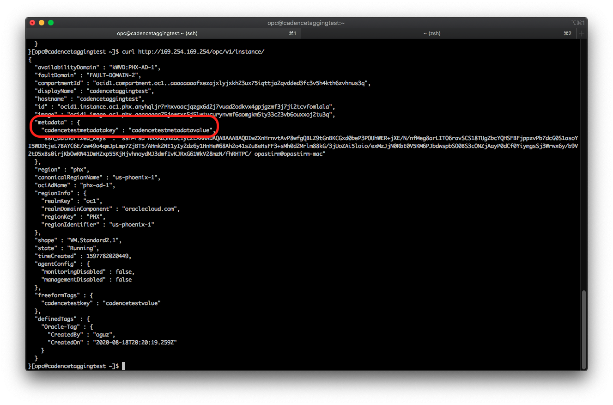

There 2 easy ways to add custom data to an instance running on OCI:

1- Adding a tag to an instance

2- Updating the extended metadata of the instance

Adding a tag is easier especially when using the OCI Console (GUI). Adding a tag also requires less priviliges in IAM.


# Adding a tag to an instance

Below steps are for adding a tag to an instance when creating it, but it's also possible to add tags to an instance after it's deployed. More info about resource tagging is available [in this link.](https://docs.cloud.oracle.com/en-us/iaas/Content/General/Concepts/resourcetags.htm)

You can use tags in the console, CLI, and API.

1- When creating an instance in the console, scroll all the way down and click on **Show Advanced Options**.

2- In the **Show Advanced Options** menu, add a new **Tag Key** and **Tag Value**. You can choose anything for both fields. You can also choose between **Free-form tags** and **Defined Tags**. The difference is that Defined Tags can only be created by tag administrators, whereas Free Form tags can be created by any user. Choose **Free-form tags** for now.



3- SSH into the instance and curl to the OCI Instance Metadata service. It will print all metadata about the instance, including the tag you added when creating the instance. You can find more information about OCI Instance Metadata [in this link.](https://docs.cloud.oracle.com/en-us/iaas/Content/Compute/Tasks/gettingmetadata.htm)

```sh
curl http://169.254.169.254/opc/v1/instance/
```



# Updating the extended metadata of the instance

The second way is using the updateable extended metadata feature in OCI. This is only available in the CLI or API, it's not in the console.

CLI example:

1- After you create the instance, run the following command to update it's metadata:

```sh
oci compute instance update --instance-id <ID of the instance> --extended-metadata '{"cadencetestmetadatakey":"cadencetestmetadatavalue"}'
```
2- Run the curl command to the instance metada service again, now you will see the values in the metadata field.




You can find more info about updating instance metadata [in this link.](https://docs.cloud.oracle.com/en-us/iaas/Content/Compute/Tasks/updatinginstancemetada.htm)
